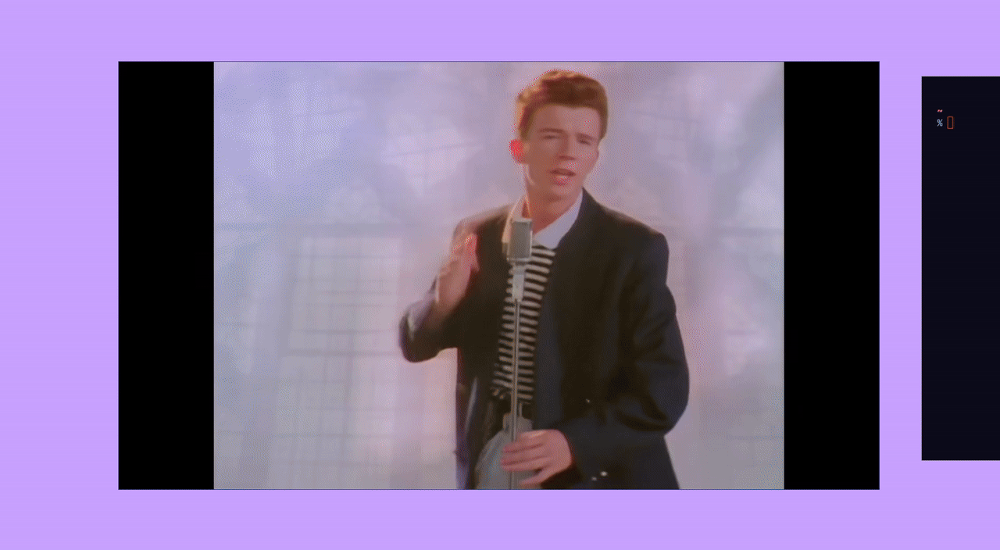

# Vallam
- A [neuswc](https://git.sr.ht/~shrub900/neuswc) based window manager written in Rust.
- Warning: work in progress.

## Dependencies

### Build dependencies
- `rust` / `cargo`
- `meson`
- `ninja`
- System libraries required by `neuswc`

### Runtime dependencies
- `swc-launch` (used to start the compositor)
- `swcsnap` (built from `neuswc` by `make`)
- `slurp` (for area selection in recording)
- `ffmpeg` (for encoding recordings)
- `notify-send` (optional, for desktop notifications)
- `brightnessctl` (default brightness key command)
- `wpctl` from PipeWire/WirePlumber (default volume key commands)

## Installation
- Run `make` in the project root.
- Optional install: `sudo make install` (installs `vallam`, `vallam-wayrec`, `swcsnap`).

## Running
Start Vallam through `swc-launch`:

- Without installing:
  - `make`
  - `swc-launch ./target/release/vallam`
- After installing:
  - `swc-launch vallam`

## Media key bindings

Vallam now binds common media keys (no modifier required):
- `XF86MonBrightnessUp` / `XF86MonBrightnessDown`
- `XF86AudioRaiseVolume` / `XF86AudioLowerVolume` / `XF86AudioMute`

Defaults:
- Brightness uses `brightnessctl set +10%` / `brightnessctl set 10%-`
- Volume uses `wpctl` on `@DEFAULT_AUDIO_SINK@`

Override commands with env vars:
- `VALLAM_BRIGHTNESS_UP_CMD`
- `VALLAM_BRIGHTNESS_DOWN_CMD`
- `VALLAM_VOLUME_UP_CMD`
- `VALLAM_VOLUME_DOWN_CMD`
- `VALLAM_VOLUME_MUTE_CMD`

## STATUS

[Watch MP4](./assets/recording.mp4)
